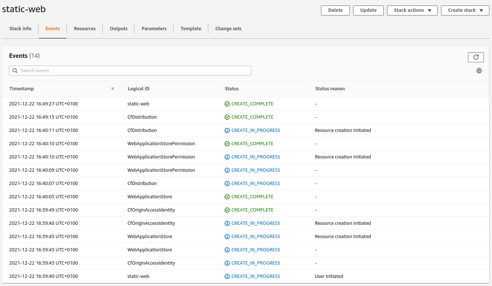
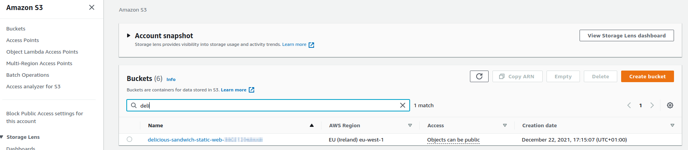
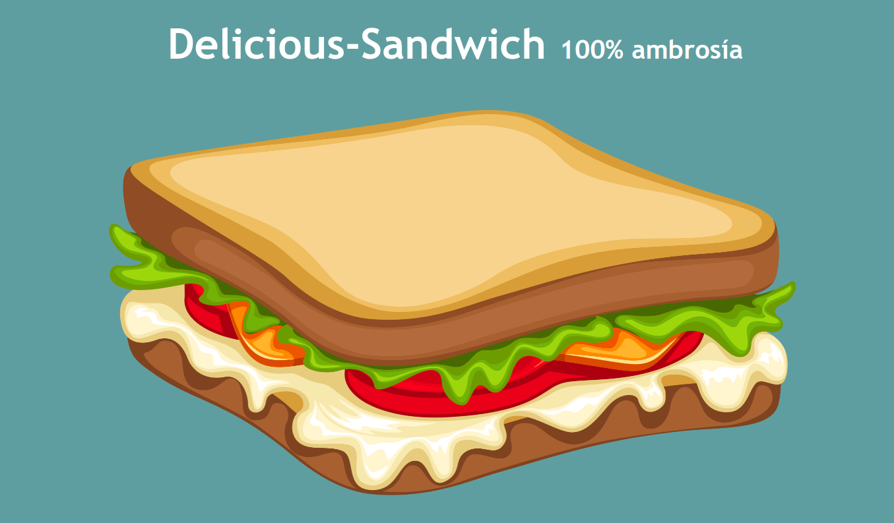

# delicious-sandwich

## Pre-requisitos
- GIT
- Una cuenta de AWS

## Despliegue
### Desplegar la infraestructura
Una vez clonado el repositorio, podemos a utilizar la consola de AWS para desplegar el stack (Bucket S3 + Distribución de CloudFront)

Entonces, vamos a la consola de AWS, a la página de CoudFormation, y elegimos la opción "With new resources" para crear el stack

Creamos el stack subiendo nuestra template de CloudFormation (/infra/delicious-sandwich.yaml)

Elegimos el nombre para el stack. El nombre del stack va a determinar el nombre con el qeu se va a crear el bucket de S3 (delicious-sandwich-<nombre_del_stack>-<id_de_la_cuenta>)

Dejamos las opciones por defecto para el stack y ya podemos desplegar el stack

### Desplegar la aplicación
El despliegue de la aplicación se hace de forma manual :)

Vamos a la página de S3 de la consola de AWS

y subimos el contenido de la carpeta "web" del proyecto

y ya tenemos desplegada nuestra applicación web estática

## Visitar Delicious-Sandwich
La URL de la web que acabamos de desplegar la podemos ver en los datos de salida (Outputs) del stack (el valor de CfDistributionDomainName)

y ya podemos visitas nuestra web estática :)

## Limpiar el stack
Antes de eliminar el stack tenemos que vaciar el bucket de S3.

Una vez qeu tenemos vacío el Bucket de S3, ya podemos eliminar el stack desde la página de CloudFormation de la consola de AWS.

